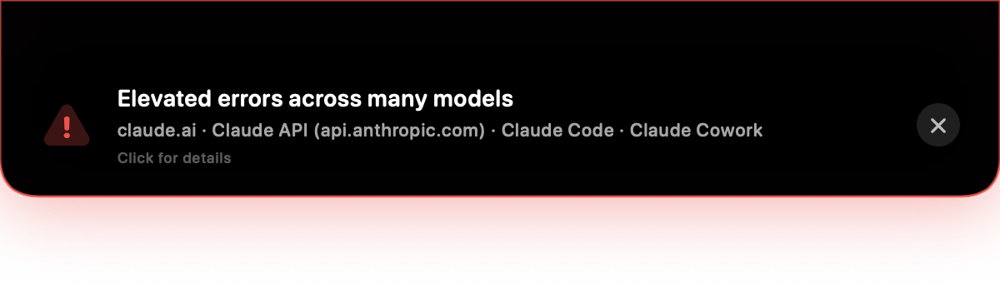
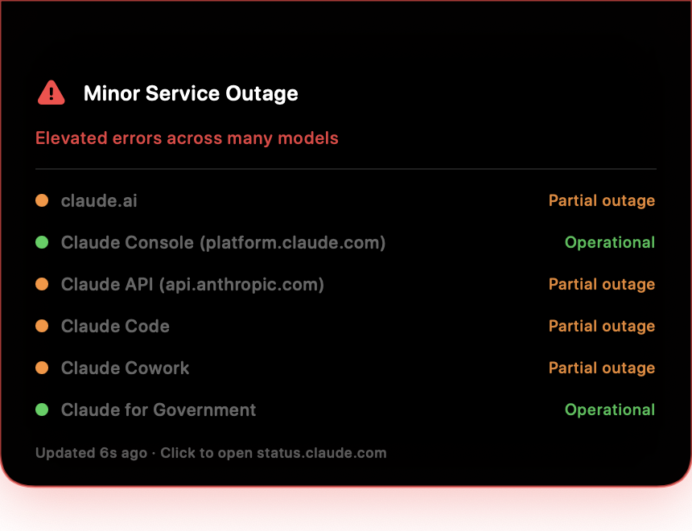

# ClaudeNotch

[](https://github.com/hidrogenone/ClaudeNotch/releases/latest)
[](https://github.com/hidrogenone/ClaudeNotch/stargazers)
[](LICENSE)
[](https://github.com/hidrogenone/ClaudeNotch/releases/latest)
[](Package.swift)

**Your MacBook's notch drops down and tells you when Claude is having a bad day.**

🌐 **[claudenotch website →](https://hidrogenone.github.io/ClaudeNotch/)**

ClaudeNotch is a tiny macOS menu bar app that watches [status.claude.com](https://status.claude.com). The moment an incident is published, the notch smoothly slides down into a Dynamic-Island-style alert showing what's broken — and your screen edges pulse red so you can't miss it. When the incident is resolved, everything retracts and goes quiet.

No more staring at a spinning Claude wondering if it's you or them. **It's them — and now you'll know instantly.**


*Live demo: the notch springs down with the alert, screen edges pulse red, ✕ dismisses.*



*Real screenshot: ClaudeNotch catching an actual live incident on status.claude.com.*

<p align="center"></p>

*Hover the notch any time to peek at live component health.*

## Features

- 🔻 **Notch drop-down alerts** — a smooth spring animation extends the notch into an alert card showing the incident title and affected components. Click it to open the incident page, or dismiss it with ✕.
- 🖱 **Hover the notch to peek** — move your mouse over the notch any time and a live status panel slides down: every component with a colored health dot, the active incident if any, and how fresh the data is. Move away and it retracts.
- 🔴 **Red screen-edge flash** — while an incident is active, all screen edges pulse with a red glow (can be turned off in the menu).
- 🧩 **Choose what you monitor** — a menu lists every component from status.claude.com (claude.ai, Claude API, Claude Code, Claude Console, …) with checkboxes. Only care about the API? Uncheck the rest.
- ⏱ **Configurable polling** — check every 30 seconds up to every 5 minutes.
- ✅ **Menu bar status at a glance** — a quiet checkmark when everything is operational, a red warning triangle during incidents.
- 🚀 **Launch at Login** toggle, **Test Alert** to preview the animation, works on Macs **with or without a notch** (no notch → the alert slides down from the top edge).
- 🪶 **Tiny and native** — pure Swift/SwiftUI + AppKit, no Electron, no dependencies, ~400 KB binary.

## Install

Requires **macOS 13 or later**. The release build is a universal binary, so it runs natively on both Apple Silicon and Intel Macs.

### One-liner (easiest)

```bash
curl -fsSL https://raw.githubusercontent.com/hidrogenone/ClaudeNotch/main/install.sh | bash
```

Downloads the latest release, installs to `/Applications`, clears the quarantine
flag (the app is ad-hoc signed, not notarized — [read the script](install.sh)
first if you like, it's 30 lines) and launches it.

### DMG

1. Grab `ClaudeNotch.dmg` from the [latest release](../../releases/latest) and drag the app to Applications.
2. First launch: right-click → **Open**. If macOS refuses ("Apple could not verify…"), either allow it under **System Settings → Privacy & Security → Open Anyway**, or run:

   ```bash
   xattr -dr com.apple.quarantine /Applications/ClaudeNotch.app
   ```

3. Hover your notch — the first-run tutorial takes it from there. Launch-at-login is set up automatically on first run (toggle it off in the menu).

### Build from source

Requires Xcode Command Line Tools (Swift 5.9+):

```bash
git clone https://github.com/hidrogenone/ClaudeNotch.git
cd ClaudeNotch
./build.sh
open build/ClaudeNotch.app
```

## How it works

ClaudeNotch polls the public Statuspage API at `https://status.claude.com/api/v2/summary.json`. When any monitored component leaves `operational` state, or an unresolved incident touches a monitored component, it raises the alert. The component list in the menu is built dynamically from the API, so if Anthropic adds new components (or per-model entries), they show up automatically.

The notch alert is a borderless `NSPanel` pinned above the menu bar; the red flash is a click-through window per screen at screensaver level — it never steals focus or blocks your clicks.

## Menu reference

| Item | What it does |
|---|---|
| Monitored Components | Check/uncheck which status.claude.com components trigger alerts |
| Check Interval | 30 s / 1 min / 2 min / 5 min polling |
| Flash Screen Edges on Incident | Toggle the red edge pulse |
| Test Alert | Fires a fake 8-second incident so you can admire the animation |
| Open status.claude.com | Opens the status page |
| Launch at Login | Starts ClaudeNotch when you log in |

## Privacy

ClaudeNotch talks to exactly one endpoint: `status.claude.com`. No analytics, no accounts, no data collected. Settings live in `UserDefaults` on your Mac.

## Disclaimer

ClaudeNotch is an independent open-source project. It is **not affiliated with, endorsed by, or sponsored by Anthropic**. "Claude" is a trademark of Anthropic, PBC — this app just reads their public status page.

## Support the project

If ClaudeNotch has ever saved you from a "wait, is it me or is Claude down?" spiral — [**star the repo ⭐**](https://github.com/hidrogenone/ClaudeNotch). It takes two seconds and helps other Claude users find it.

Found a bug or want a feature? [Open an issue](../../issues) — PRs welcome.

## License

[MIT](LICENSE)
